# Try Hack Me - Ignite - WriteUp

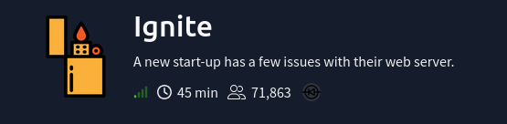

## Reconnaissance

We first try our connectivity to the machine

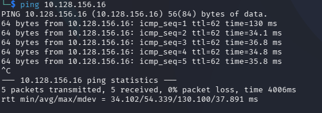

Once checkes we can then proceed to the reconnaissance phase.
We start with a simple `nmap` command to obtain open ports information:

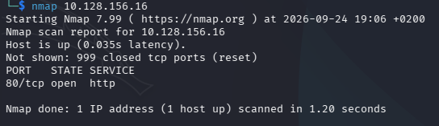

We can see there is a web running on port 80, later we will take a look to that web. But I always like to do a more complex scan to obtain versions and scan the whole port range in case there are open services "hidden" in not common ports.

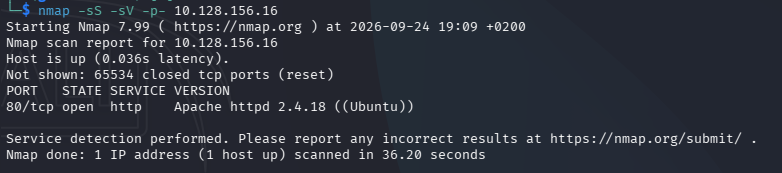

So then with the ``` nmap -sS -sV -p- 10.128.156.16 ``` command we then scan the complete port range with SYN packets trying to identify the versions on the services.

We obtain, as seen, that the port 80 is running a web server lets navigate and see what the page looks like.

## Web Enumeration
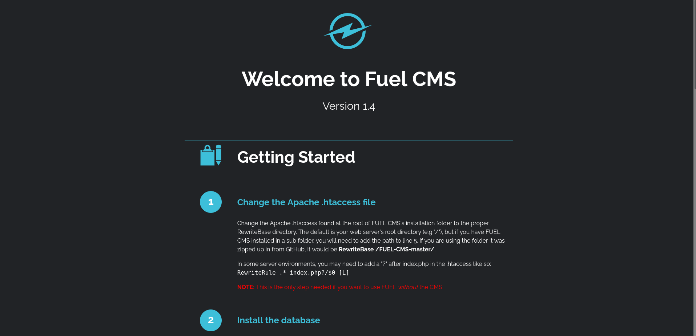

We encounter what it seems a configuration file of Fuel CMS, looking what is fuel cms, its a hbrid content management system and development platform. Looking through the page nothing seems to matter taht much, except for the Step 2 "Install the database": 

"Install the FUEL CMS database by first creating the database in MySQL and then importing the fuel/install/fuel_schema.sql file. After creating the database, change the database configuration found in fuel/application/config/database.php to include your hostname (e.g. localhost), username, password and the database to match the new database you created."

This seems a file where we could grab some credentials but whe dont have the access yet.
We then try to enumerate the web, we know the version os fuel cms we could try to see if there are some exploits for this version. But I always like to visit the robots.txt if it exists.

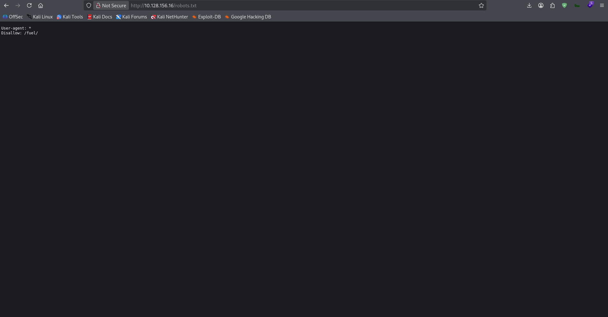

We see a fuel directory, lets see whats in there

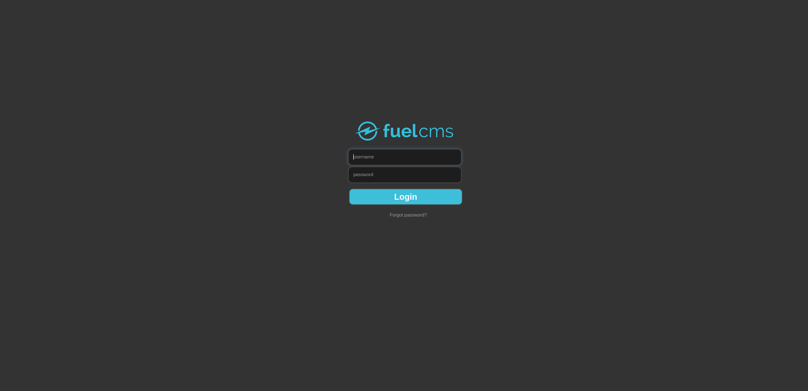

Interesting we could try some default credentials like admin:admin or admin:1234, lets try it.

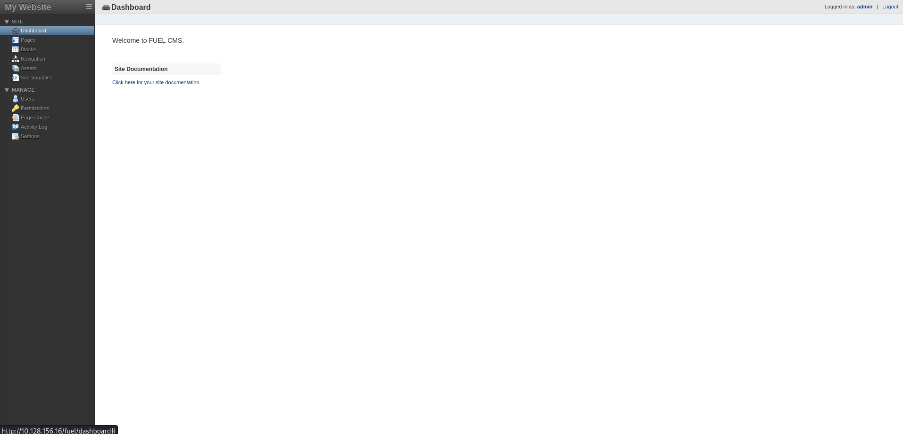

And booom! We are in the admin panel with the admin:admin credentials. Lets navigate to try to discover new information.
In the fuelcms doccumentation we can see that the version is the 1.4 as we've seen earlier. 

I dont see much information here lets try to see if there are common CVEs or exploits with fuel cms 1.4.

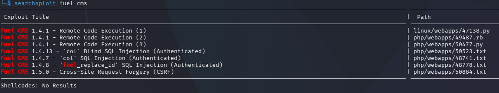

There are a few RCE for this version. Lets try the python script and see if it works.
We download it with the ``` searchsploit -m php/webapps/50477.py ``` command and we execute it with ```python3 50477.py -u <url> ```.

## Exploitation

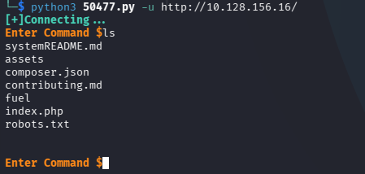

We have command execution!! Now we try to improve it by spawning a reverse shell.
We start listening on another terminal with ```nc -lvnp 1337``` and we execute the reverse shell command you can find in pages like https://www.revshells.com/ or similar.

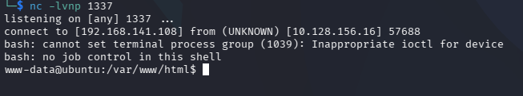

We are on the system with an interactive shell.

## Initial Access

Once we obtained access we can look for the flag on the home directory:

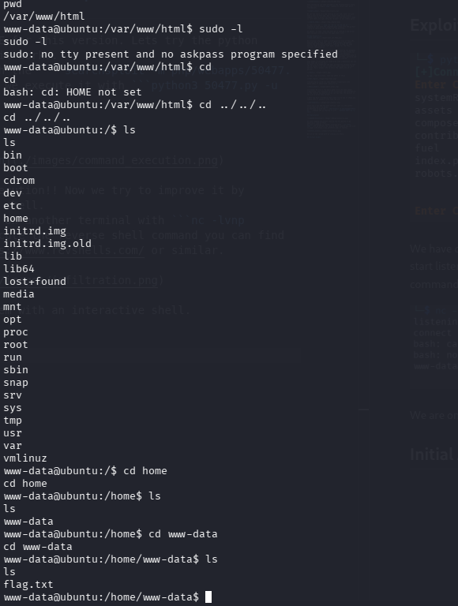

And there it is the flag! Now we need to escalate privileges to obtain the root flag!

## Privilege Escalation

We then remember what we saw on the step 2 of the fuel cms configuration file, we saw that there was a database.php with user and password credentials, lets see if there are root credentials there

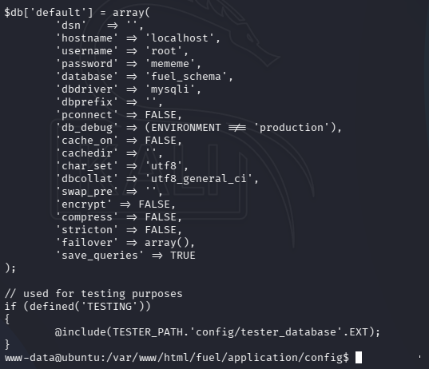

And there are the credentials for root user, we were lucky there. Lets see if are valid to escalate privileges.

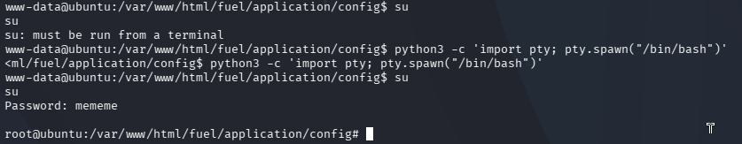

We encountered some problems while trying to escalate, this is because this is not a fully functional shell we need to upgrade it.

## Root
And with these we obtained root and the root flag!!

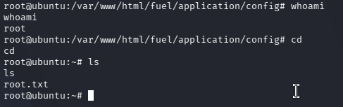

## Observations
This was a fun and dynamic machine, not very complicated I have to say, the dificulty maybe was on enumerating the few things that were on the machine and remembering the configuration file to obtain the root credentials.


